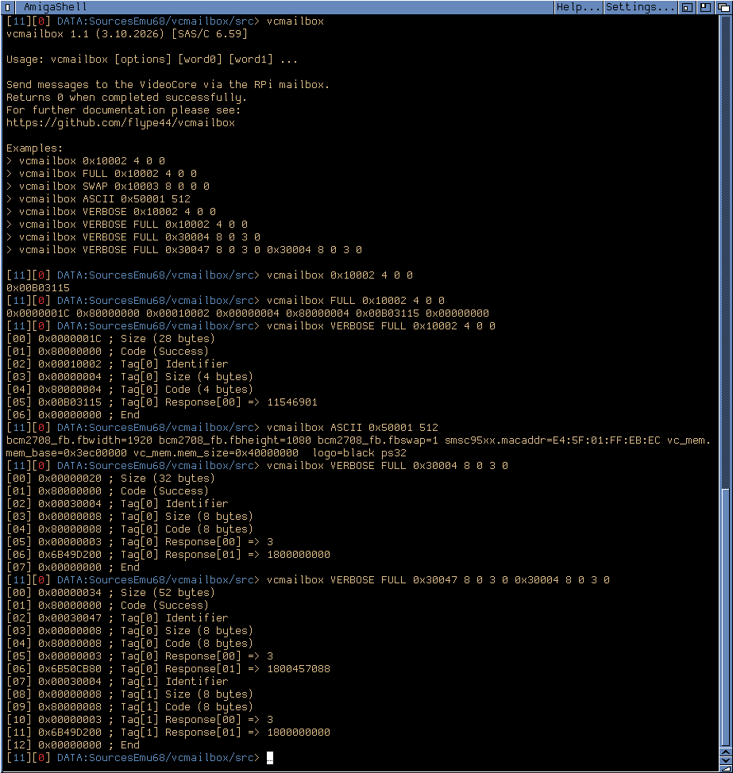

# vcmailbox

Send messages to the VideoCore via the Raspberry Pi mailbox, from the AmigaOS shell.

AmigaOS port of the Linux `vcmailbox` utility, for
[PiStorm](https://github.com/captain-amygdala/pistorm) /
[Emu68](https://github.com/michalsc/Emu68) systems. It uses `mailbox.resource` and has no
dependency on the C runtime library.



## Requirements

- AmigaOS 3.x on a PiStorm/Emu68 setup providing `mailbox.resource`

## Installation

Copy `bin/vcmailbox` to `C:`, and optionally `bin/vcmailbox.help` to `HELP:`.

## Usage

```
vcmailbox [ASCII] [SWAP] [FULL] [VERBOSE] <word0> [word1] ...
```

| Option    | Description                                                        |
|-----------|--------------------------------------------------------------------|
| `ASCII`   | Print the response of the first tag as text (e.g. tag `0x50001`).  |
| `SWAP`    | Cancel the byteswapping of `mailbox.resource`, for blobs such as the MAC address. |
| `FULL`    | Print the whole message, not only the response values.             |
| `VERBOSE` | Print one annotated line per word.                                 |

Options go before the words. Numbers are decimal, hexadecimal (`0x...`) or octal.
The trailing zero words of the last tag may be omitted: `0x10002 4` is `0x10002 4 0 0`.

Exit status: `0` OK, `5` the VideoCore returned an error, `10` invalid arguments,
`20` `mailbox.resource` not available.

## Examples

```
> vcmailbox 0x10002 4 0 0                ; board revision
> vcmailbox SWAP 0x10003 8 0 0 0         ; MAC address
> vcmailbox 0x30006 8 0 0 0              ; temperature
> vcmailbox ASCII 0x50001 512            ; kernel command line
> vcmailbox VERBOSE FULL 0x30047 8 0 3 0 ; ARM clock rate
```

See [`bin/vcmailbox.help`](bin/vcmailbox.help) for the full documentation and many more
examples, and the
[Mailbox property interface](https://github.com/raspberrypi/firmware/wiki/Mailbox-property-interface)
for the list of tags.

## Building

Requires SAS/C 6.59. From the `src` directory:

```
> smake
```

## Author

Philippe Carpentier
